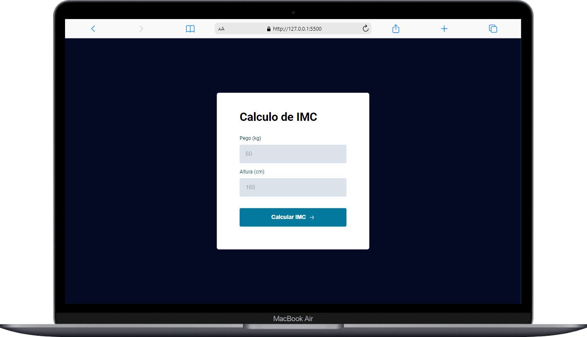
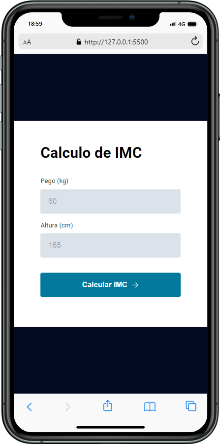

<h1 align="center">Calculadora De IMC basica
</h1>

## 🚀 Tecnologias

Esse projeto foi desenvolvido com as seguintes tecnologias:

- HTML
- CSS
- JavaScript

## 💻 Projeto

uma calculadora de IMC simples

## 🎓 Aprendizado
- função isNaN()
- propriedade defer no script
- import e export type="module"
- função oninput()
## ℹ️ sobre

Esse projeto foi feito apartir do aprendizado da maratona Explorer da rocketseat

## imagens do projeto

## imagens do projeto em display menores

    

